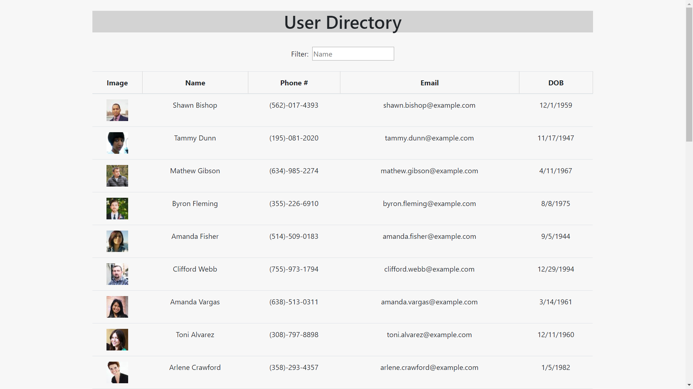

## User Directory

Directory app built with React.

* As a user, I want to be able to view my entire employee directory at once so that I have quick access to their information.
An employee or manager would benefit greatly from being able to view non-sensitive data about other employees. It would be particularly helpful to be able to filter employees by name.

Given a table of random users, when the user loads the page, a table of employees should render. 

The user will be able to:

  * Sort the table by Name

  * Filter the users by searching through first name

This project was bootstrapped with [Create React App](https://github.com/facebook/create-react-app).

## Technology

-React
-JSX
-Node
-Heroku

## Install

Clone the repo.
In the project directory, you can run: 'npm instal' and then:

### `npm start`

Runs the app in the development mode. 
Open [http://localhost:3000](http://localhost:3000) to view it in the browser.

The page will reload if you make edits. 
You will also see any lint errors in the console.

## Learn More

You can learn more in the [Create React App documentation](https://facebook.github.io/create-react-app/docs/getting-started).

To learn React, check out the [React documentation](https://reactjs.org/).

### Deployment

The app is currently deployed via Heroku here: 